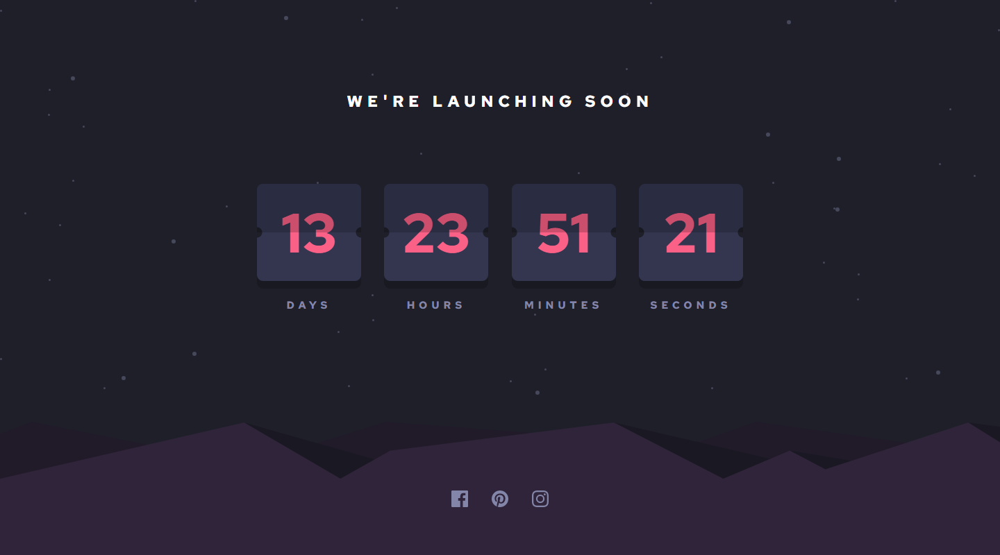

# Frontend Mentor - Launch countdown timer solution

This is a solution to the [Launch countdown timer challenge on Frontend Mentor](https://www.frontendmentor.io/challenges/launch-countdown-timer-N0XkGfyz-). Frontend Mentor challenges help you improve your coding skills by building realistic projects.

## Table of contents

- [Overview](#overview)
  - [The challenge](#the-challenge)
  - [Screenshot](#screenshot)
  - [Links](#links)
- [My process](#my-process)
  - [Built with](#built-with)
  - [What I learned](#what-i-learned)
- [Author](#author)

## Overview

### The challenge

Users should be able to:

- See hover states for all interactive elements on the page
- See a live countdown timer that ticks down every second (start the count at 14 days)
- When a number changes, make the card flip from the middle

### Screenshot

### Links

- Solution URL: [Solution](https://www.frontendmentor.io/solutions/launch-countdown-timer-using-reactjs-typescipt-scss-EioEI-buX)
- Live Site URL: [Live site](https://lukakobaidze-launchcountdown.netlify.app/)

## My process

### Built with

- [React](https://reactjs.org/) - JS library
- TypeScript
- SCSS
- CSS custom properties

### What I learned

I got better at working with svgs, learned how to style them the way i want. Also got better at TypeScript, this was my first time using TypeScript with React in a project and this was a good practice. I learned how to make card flip from the middle, which was the most difficult part of this challenge, after lot of experiments I finally implemented it and I'm really happy about it.

## Author

- Frontend Mentor - [@LukaKobaidze](https://www.frontendmentor.io/profile/LukaKobaidze)
- FreeCodeCamp - [@lukakobaidze](https://www.freecodecamp.org/lukakobaidze)
